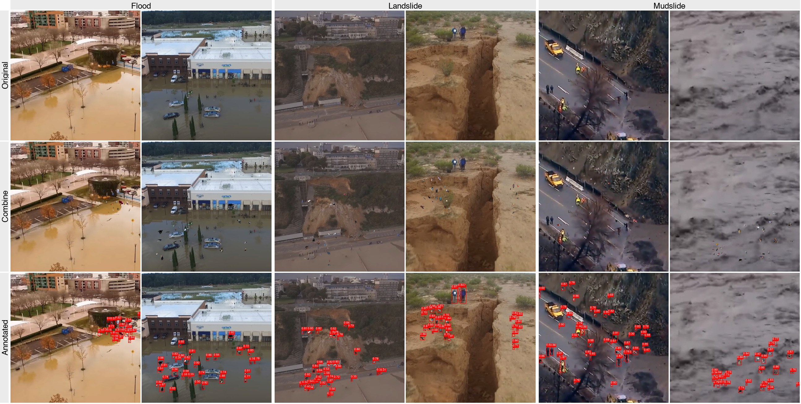

# Long-Range Human Detection in SAR: The C2A Cluster-Based Synthetic Approach



*Synthetic image produced and the detections of the released weights*

Reproducible pipeline for the synthetic dataset and the detector presented in:

> A. J. Dantas Fh, E. H. Teixeira, L. D. Jesus, W. M. Martins, A. A. Chaves, E. H. Shiguemori and T. C. Pimenta, **"Long-range human detection in SAR: The C2A cluster-based synthetic approach"**, *Seventh International Conference on Computer Vision and Information Technology (CVIT 2026)*, SPIE vol. 14321, pp. 21-28, 2026.

**The synthetic dataset (v4) is included in this repository**: 6,817 images and 174,295 *person* boxes in YOLO format under `out/` - including 733 person-free background images (10.8 %) - ready for `yolo train data=out/dataset.yaml`. Sections 3 and 4 explain how it was built and how to regenerate it or the other versions.

Search-and-rescue (SAR) datasets rarely show people partially submerged in muddy water or surrounded by debris. The paper builds such a dataset synthetically with a **Combination-to-Application (C2A)** pipeline: validated human cut-outs (MPHB) are pasted onto real aerial shots of hydrological disasters, **in clusters rather than uniformly**, below an automatically detected sky line and without covering the people that already appear in the shot. A YOLO11n trained on the best version (v4) reached P = 0.907 and mAP50 = 0.844 on its own test split and generalised competitively to SARD, HERIDAL, LADD, AFO, SeaDronesSee and C2A.

```
datasets/ (aerial flood / landslide shots)        persons/raw (MPHB, 26,675 images)
     |                                                   |
  01 curate + pHash de-dup                        04 rembg (U2-Net human)
     |                                               + YOLOv8x person check >= 0.50
  03 YOLOv8x: people already in the shot --+         + crop to box
  02 SegFormer: sky line (cloud.txt) ------+              |
                                           |              |
                                           v              v
                     05 cluster-based C2A composition + instance augmentation
                                           |
                     06 split 80/10/10 (by background) -> out/dataset.yaml
                                           |
                     07 YOLO11n, 100 epochs, 640 px, Adam, batch 16
```

## 1. Layout

```
public/
|-- config.py                  paths, model names, augmentation ranges, presets v1-v5
|-- pipeline_utils.py          helpers shared by the steps
|-- 01-prepare-backgrounds.py  datasets/** -> backgrounds/images + manifest (pHash de-dup)
|-- 02-sky-mask.py             SegFormer-B0 (ADE20K "sky") -> backgrounds/cloud.txt
|-- 03-annotate-backgrounds.py YOLOv8x person boxes already in the shots -> backgrounds/labels
|-- 04-prepare-persons.py      MPHB -> rembg -> YOLOv8x validation (>= 0.50) -> persons/valid
|-- 05-combine.py              cluster-based C2A synthesis -> out/images, out/labels
|-- 06-split.py                80/10/10 split -> out/train.txt, val.txt, test.txt, dataset.yaml
|-- 07-train.py                YOLO11n training / evaluation -> out/runs
|-- 08-stats.py                images / instances per subset (compare with Table 3)
|-- 09-example-figure.py       Fig. 1-style grid (Original / Combine / Annotated) -> out/diagram.png
|-- run_all.sh                 the whole thing, in order
|-- requirements.txt
|-- docs/                      figures used in this README
|-- datasets/                  INPUT  - one folder per public source (see section 2)
|-- persons/raw/               INPUT  - MPHB images
|-- models/                    downloaded weights (auto)
|-- backgrounds/               step 01-03 outputs
|-- persons/valid/             step 04 output (transparent PNG cut-outs)
|-- out/                       step 05-07 outputs (YOLO dataset + runs)
`-- out/weight/best.pt         released detector weights (download, see section 5)
```

The repository tracks the code, this README, `docs/` and the **produced dataset** (`out/images`, `out/labels`, split lists, `dataset.yaml`, `manifest.csv`). Inputs (`datasets/`, `persons/`), downloaded weights (`models/`), intermediates (`backgrounds/`, `persons/valid/`) and the released detector (`out/weight/`) are git-ignored, see `.gitignore`.

## 2. Inputs

**Backgrounds** (`datasets/<SOURCE>/`): aerial views (about 30 to 150 m) of floods, landslides and mudslides, manually filtered from:

| folder | source |
|---|---|
| `AIDER/` | Aerial Image Database for Emergency Response (Kyrkou and Theocharides, 2019), *flood* class |
| `ERA/` | Event Recognition in Aerial videos (Mou et al., 2020), *Flood*, *Landslide*, *Mudslide* |
| `ALLEY/` | Alley Flood Net (Electronics 14(10):2082, 2025) |
| `KAGGLE/` | Kaggle flood-image collections (Karanjit, Pally and Samadi 2022; Karim, Sharma and Barman 2022) |
| `ROBOFLOW/` | Roboflow Universe projects *landslide*, *flood-area-segmentation*, *flood-detection* |

Place the selected images in these folders (they are not redistributed here because of the sources' licences). The run documented below started from 2,349 images; step 01 removed 304 near-duplicates and kept **2,045** (the paper reports about 2,000).

**Human figures** (`persons/raw/`): the *Multiple Poses Human Body* dataset (MPHB, Cai et al., 2016), 26,675 images of people in bent, kneeling, sitting, standing and lying poses. Download it from the authors and copy the JPGs into `persons/raw/`.

## 3. Setup

```bash
cd public
python3.12 -m venv .venv && source .venv/bin/activate
pip install -r requirements.txt          # rembg[gpu] on CUDA machines
```

Weights (`yolov8x.pt`, `yolo11n.pt`, `u2net_human_seg.onnx`, SegFormer-B0) are downloaded automatically into `models/` on first use.

## 4. Step by step

Every step is **resumable** (already-processed files are skipped) and has `--help`, `--limit N` for a quick check and a fixed seed (`config.SEED = 42`).

### 01 - Background curation (paper Sec. 3.1.1)
```bash
python 01-prepare-backgrounds.py
```
Walks `datasets/**`, renames files to a flat, shell-safe scheme (`<SOURCE>_<name>`), computes a perceptual hash and drops near-duplicates (Hamming distance <= 7, the value used by the original `duplicate.py`). Writes `backgrounds/images/` and `backgrounds/manifest.csv`.

### 02 - Sky exclusion mask (paper Sec. 3.1.1)
```bash
python 02-sky-mask.py --preview 20
```
Semantic segmentation with **SegFormer-B0 (ADE20K)**. For every image the lowest pixel row classified as *sky* (when sky touches the top 20 % of the frame) is written to `backgrounds/cloud.txt` as `"<file> <px>"`. Step 05 never pastes a figure above that line, so nobody "floats in the sky". Images without an entry fall back to a 30 % top band. Segmentation runs on a copy of at most 1024 px (`SKY_MAX_SIDE`) and the row is scaled back. In this run 923 of the 2,045 backgrounds received a band (mean 53 px).

### 03 - People already present in the shots (paper Sec. 3.1.3)
```bash
python 03-annotate-backgrounds.py --preview 30
```
Some disaster shots already contain rescuers or victims. **YOLOv8x (COCO, class *person*, conf >= 0.30, 1280 px)** annotates them into `backgrounds/labels/<stem>.txt`. These real boxes are (i) copied into the label of every synthetic image generated from that background and (ii) treated as occupied space so pasted figures never overlap them. The boxes can be checked in `backgrounds/preview/labels/`. In this run 180 backgrounds contain people, giving 452 real boxes (1,356 after the three variants).

### 04 - Human figures (paper Sec. 3.1.2)
```bash
python 04-prepare-persons.py
```
For every MPHB image:
1. **Background removal**: `rembg` with the U2-Net `u2net_human_seg` model; the alpha channel is trimmed to its bounding box.
2. **Identification and clipping**: the cut-out is placed on white and checked with YOLOv8x; it is kept only if a *person* is found with **confidence >= 0.50**, no other COCO class is detected, at least 100 px are opaque and at least 2 % of the patch is transparent. The patch is re-cropped to the detected box and saved to `persons/valid/<id>.png`.

`persons/report.csv` records the decision for every image. The paper ends this stage with about 18,000 valid figures; this run keeps **17,111** (5,876 *no person*, 3,577 *other objects*, 111 empty or too small).

### 05 - Cluster-based C2A composition (paper Sec. 3.1.3 and 4.1)
```bash
python 05-combine.py                 # v4, the published configuration
python 05-combine.py --version v2    # any preset from config.VERSIONS
```
For each background three images are generated (backgrounds larger than 1280 px are shrunk first, `BG_MAX_SIDE`; training uses 640 px). Each starts from the real person boxes of step 03 and then inserts new instances:

| version | mode | clusters | grid / cluster | per cell | cap / image | augment | note |
|---|---|---|---|---|---|---|---|
| v1 | full fill | - | 3x4 + random fill | 2 | 100 | no | baseline after Nihal et al. |
| v2 | full fill | - | 3x4 + random fill | 2 | 100 | yes | |
| v3 | clusters | 1-3 | 5x5 | 3 | 30 | yes | |
| **v4** | clusters | 1-5 | 4x4 | 2 | 30 | yes | **best, published model** |
| v5 | clusters | 1-7 | 3x3 | 2 | 30 | yes | |

Clusters are rectangles covering 10 to 50 % of the frame, drawn under the sky line (IoU between clusters <= 0.3). Each cluster has an internal grid and every cell receives 1 to *per cell* figures until the per-image cap is reached, which produces the groupings of survivors the paper argues for.

Every figure is reduced to at most 81 px and scaled to **1 to 4 %** of the shorter side of the background. With `augment` on (v2 to v5) it is also rotated in **[-90, +90] degrees** and may get a one-side crop (occlusion, up to 10 %), local brightness matching (factor 0.5 to 1.5), Gaussian blur (radius 0.3 to 1.2), noise (blend 0.1 to 0.3) and JPEG re-compression (quality 10 to 80), each with probability 0.3 (Sec. 4.1, after InstaBoost). v1 pastes the figures as they are. Boxes never overlap (2 px margin).

**Background-only images.** `background_fraction` (0.10) reserves 10 % of the dataset for *negatives*: the bare aerial shot with an **empty label file**. They are sampled, with the pipeline seed, only among the backgrounds that contain no real person (step 03), so the negative is genuinely person-free, and they are recorded in the manifest as the extra variant `bg` of their background - which keeps them in the same subset as their siblings when step 06 splits per background. The share follows the usual Ultralytics recommendation of about 10 % of background images and teaches the detector what an empty flood or landslide scene looks like (debris, foam, rocks and wet vegetation are the main sources of false positives here).

```bash
python 05-combine.py --background-only          # add only the missing negatives
python 05-combine.py --background-fraction 0.0  # disable them
```

Outputs: `out/images/img_XXXXXX.jpg`, `out/labels/img_XXXXXX.txt`
(class 0 = person, real + pasted), `out/manifest.csv` (background, variant, number of real and pasted boxes, sky line) and `out/debug/` with triples *background / composite / boxes* for the first 30 images (blue = real people, red = pasted).

### 06 - Split (paper Sec. 4.1)
```bash
python 06-split.py
```
80 % / 10 % / 10 %. The split is made **per background**, so the three variants of one shot - and its background-only image, when it has one - always fall in the same subset. This keeps the share of negatives close to the target in each subset without any extra balancing. Produces `out/train.txt`, `out/val.txt`, `out/test.txt` and `out/dataset.yaml` (paths relative to `out/`, so the folder can be moved).

### 07 - Training and evaluation (paper Sec. 4.1 and 4.2)
```bash
python 07-train.py                       # YOLO11n, 100 epochs, 640 px, Adam, batch 16
python 07-train.py --evaluate out/runs/yolo11n_v4/weights/best.pt          # test split
python 07-train.py --evaluate best.pt --data /path/SARD/data.yaml --split val
                                         # cross-dataset evaluation, as in Tables 4-5
```
`--evaluate` also prints the **confusion matrix** of the run (section 6.1) next to P / R / mAP; Ultralytics writes `confusion_matrix.png` and `confusion_matrix_normalized.png` to `out/runs/eval/` at the same time. Add `--image-level` for the per-image matrix of section 6.2, the one that tells how many background-only images the model actually read as background. Same recipe as the paper (Ultralytics 8.3.205 / PyTorch 2.8 / RTX 5090 in the original run). Use `--epochs 1 --fraction 0.02` for a smoke test; a full run on CPU or Apple MPS takes many hours.

### 08 - Statistics
```bash
python 08-stats.py
```
Prints images / instances per subset to compare with Table 3 of the paper (OURs: 6,162 images, 226,638 instances). Result of this run (v4):

| subset | images | instances | real | pasted | inst/img | background-only |
|---|---:|---:|---:|---:|---:|---:|
| train | 5,430 | 139,551 | 1,224 | 138,327 | 25.7 | 563 (10.4 %) |
| val | 686 | 17,235 | 36 | 17,199 | 25.1 | 78 (11.4 %) |
| test | 701 | 17,509 | 96 | 17,413 | 25.0 | 92 (13.1 %) |
| **total** | **6,817** | **174,295** | 1,356 | 172,939 | 25.6 | **733 (10.8 %)** |

Mean normalised box size 0.021 x 0.023 (about 13 x 15 px at 640 px), the long-range, small-object regime targeted by the paper. The background-only count is slightly above the 10 % target because 51 of the composed images ended up empty as well (a background whose whole allowed area was rejected, mostly very small or almost entirely sky frames); they are legitimate negatives and are kept.

### 09 - Example figure (optional)
```bash
python 09-example-figure.py                                # label boxes
python 09-example-figure.py --weights out/weight/best.pt   # detector boxes + confidence
```
Builds `out/diagram.png`: Flood / Landslide / Mudslide examples from the ERA backgrounds, rows *Original*, *Combine* and *Annotated* (as Fig. 1).

## 5. Pre-trained weights

The detector trained on the v4 dataset is released as **`best.pt`** (Ultralytics YOLO11 checkpoint, single class *person*, 100 epochs, 640 px, batch 16, Ultralytics 8.3.205; YOLO11x backbone, 56.9 M parameters, 114 MB). It is larger than GitHub's 100 MB file limit, so it is distributed as a release asset rather than inside the repository:

```bash
mkdir -p out/weight
curl -L -o out/weight/best.pt \
  https://github.com/AntonioDantas/cvit/releases/download/v1.0/best.pt
```

Then:

```bash
python 07-train.py --evaluate out/weight/best.pt          # metrics on the test split
python 09-example-figure.py --weights out/weight/best.pt  # figure above
yolo predict model=out/weight/best.pt source=my_flight.mp4 imgsz=640 conf=0.25
```

## 6. Results reported in the paper

Dataset versions, YOLO11n on the respective test split (Table 1):

| version | Precision | Recall | mAP50 | mAP50-95 |
|---|---|---|---|---|
| v1 | 0.8621 | 0.6758 | 0.7638 | 0.3977 |
| v2 | 0.8819 | 0.7437 | 0.8351 | 0.4897 |
| v3 | 0.8961 | 0.7488 | 0.8327 | 0.4855 |
| **v4** | **0.9074** | **0.7598** | **0.8441** | **0.4967** |
| v5 | 0.8839 | 0.7390 | 0.8122 | 0.4140 |

### 6.1 Confusion matrix of the released model

`python 07-train.py --evaluate out/weight/best.pt --split test` on the 701 test images of the dataset described above (92 of them background-only), Ultralytics 8.4.157 / PyTorch 2.14 / Apple M4 MPS, 640 px, default val thresholds (conf 0.25, IoU 0.45):

| pred \ true | person | background |
|---|---:|---:|
| **person** | 13,864 | 913 |
| **background** | 3,645 | 0 |

TP = 13,864, FP = 913, FN = 3,645, precision = 0.938, recall = 0.792
(`P = 0.9104  R = 0.7942  mAP50 = 0.8558  mAP50-95 = 0.4790` over the whole
sweep of thresholds). Columns are the ground truth and rows the prediction; the *background* row counts labelled people that were missed and the *background* column counts boxes drawn on an empty patch of scene. The true-background / predicted-background cell is 0 by construction: an image with no person and no detection produces no entry, so a background-only image appears in this matrix only when it costs a false positive.

### 6.2 Are the background images read as background?

The box-level matrix cannot answer that: it counts boxes, and an image with no person and no detection produces no box, hence the 0 above. Ultralytics only ever writes three cells (`ultralytics/utils/metrics.py`: `matrix[dc, gc]` = TP, `matrix[dc, nc]` = FP, `matrix[nc, gc]` = FN) - there is no `matrix[nc, nc]`, because a "true negative" in detection would be every empty region that received no box, a quantity with no natural unit.

So the negatives are scored at the **image level** instead - *does the model see anybody in this frame?* - where a person-free scene left completely clean is a genuine true negative:

```bash
python 07-train.py --evaluate out/weight/best.pt --split test --image-level
```

| pred \ true | person | background |
|---|---:|---:|
| **person** | 594 | 10 |
| **background** | 15 | 82 |

701 test images, 92 of them person-free, conf 0.25. **82 of the 92 (89.1 %) were read as background**, i.e. produced no detection at all. The remaining 10 produced 19 boxes in total (0.21 false positives per person-free image), about 2 % of the 913 false positives of section 6.1 - the rest are near-misses inside the crowded composites. Among the 609 populated images the model finds somebody in 594 (97.5 %).

This matrix is not comparable with the box-level one nor with the tables of
the paper: it answers a per-image question, and it exists only to measure the
negatives.

### 6.3 What the negatives cost in the metrics

Evaluating the same weights on the same test split with and without its 92 background-only images isolates their effect (`--data` pointing at a list of the 609 populated images only):

| test split | images | P | R | mAP50 | mAP50-95 | FP |
|---|---:|---:|---:|---:|---:|---:|
| positives only | 609 | 0.9134 | 0.7926 | 0.8565 | 0.4792 | 896 |
| with negatives | 701 | 0.9104 | 0.7942 | 0.8558 | 0.4790 | 913 |
| difference | +92 | **-0.0030** | +0.0016 | -0.0007 | -0.0002 | +17 |

Precision loses 0.3 percentage point and mAP is unchanged to the third decimal. Recall cannot really change - the 17,509 instances are the same - and the +0.0016 is only the best-F1 operating point sliding along the curve. So the negatives make the test split slightly harder, as intended: they can only add false positives, never true positives, and 0.3 pp is the honest price of measuring something the previous split did not measure at all.

These weights were trained *before* the background images existed, so both matrices and this comparison are the **baseline** that retraining on the dataset with its 10 % of negatives is meant to improve.

### 6.4 Cross-domain evaluation

Cross-domain evaluation of the v4 model ("OURs") on the validation sets of public SAR datasets (Tables 4 and 5), considering only models tested outside
their own domain: in precision OURs is the best on AFO (0.63) and C2A (0.51)
and within 0.05 of the best on SeaDronesSee; its lowest relative scores are on the terrestrial sets SARD, HERIDAL and LADD. In recall it is the best on SARD, AFO, SeaDronesSee and C2A and is surpassed only on HERIDAL and LADD.

## 7. Notes on this re-implementation

* The numbered scripts consolidate the original research scripts (`cloud.py`, `identify.py`, `remover_fundo.py`, `validacao_claude.py`, `corte.py`, `combine.py`, `duplicate.py`, ...) into one linear, resumable pipeline with a single `config.py`.
* Version presets follow the parameters printed in the paper. The per-image cap of 30 for the cluster versions and 100 for the fill versions reproduce the "about 30 / about 100 instances per image" figures.
* In the paper the 50 % confidence check of Sec. 3.1.2 is attributed to the U-Net stage. In the original validation script, and here, U2-Net only removes the background; the confidence threshold comes from a COCO person detector (YOLOv8x) run on the cut-out.
* The paper lists a crop factor of 0.01; the original code (and this one) uses 0.10 (up to 10 % of one side). With 0.01 the crop would remove less than one pixel from patches of 81 px or less.
* v1 ("unaltered markings") keeps only the scale needed to fit the figure in the scene; rotation and every other change are off.
* The per-image cap of 30 gives 28.6 instances per populated image here (25.6 over the whole dataset, which now includes the negatives) versus 36.8 in Table 3 of the paper (the original run also counted the real boxes and used a slightly different fill); adjust `max_per_bg` in `config.VERSIONS` to change the density.
* The paper does not mention background-only images; they were added here because the generated dataset had none, and an object detector trained without negatives tends to hallucinate people on debris and foam. The share (10 %) is the common Ultralytics recommendation, not a value taken from the paper.
* Real people in the backgrounds are pseudo-labelled by YOLOv8x at conf >= 0.30; small figures below that confidence remain unlabeled background.
* Steps 02, 03 and 04 each load a large model; on a 16 GB machine run them one at a time (as `run_all.sh` does). Timings on an Apple M4: 01 about 1 min, 02 about 25 min, 03 about 20 min, 04 about 2 h, 05 about 5 min.

## 8. Citation

```bibtex
@inproceedings{fh2026long,
  title     = {Long-range human detection in SAR: The C2A cluster-based synthetic approach},
  author    = {Fh, Antonio J Dantas and Teixeira, Eduardo H and Jesus, Leandro D and
               Martins, Wander M and Chaves, Antonio A and Shiguemori, Elcio H and
               Pimenta, Tales C},
  booktitle = {Seventh International Conference on Computer Vision and Information
               Technology (CVIT 2026)},
  volume    = {14321},
  pages     = {21--28},
  year      = {2026},
  organization = {SPIE}
}
```
